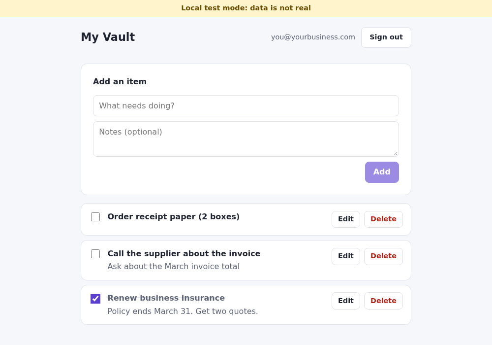

# Firebase vault starter

**You don't vibe code your own vault.** Logins and private data are the one part of an app where "it seems to work" isn't good enough: a mistake doesn't show up as a bug, it shows up as a stranger reading your customers' records. So this part is built once, carefully, with automated tests that prove who can see what. You build only the parts that are yours.

This is a starting point for people who build with Claude and Claude Code. It's for business owners and operators who have already built a small internal tool and now want one with **logins and saved data**.



## What it does

- People sign in with **Google** or with a **link emailed to them**. No passwords to leak or reset.
- Each person can add, edit, tick off and delete their own records ("items", an example you'll replace).
- **Nobody can see or change anyone else's records.** 38 automated tests prove it, in plain English.
- While you build, everything runs on your computer with test data (the yellow "Local test mode" bar). Real data is never touched.
- It's published free on Firebase Hosting as a plain website. No servers to look after.

## Get started

You need a Google account and about 30 minutes. [**docs/SETUP.md**](docs/SETUP.md) walks through every step with pictures. In short:

```
npm install          # once
npm run dev          # try it on your computer, no Firebase account needed
npm run test:rules   # prove the privacy rules hold
npm run setup        # create your Firebase project and put the app online
```

`npm run setup` does the Firebase setup for you: it creates the project, the database, and both sign-in methods, then publishes the app.

## The docs

- [**SETUP.md**](docs/SETUP.md): from zero to a live app, step by step, with pictures.
- [**SPINE.md**](docs/SPINE.md): how the data is filed. One manila folder per person.
- [**SECURITY.md**](docs/SECURITY.md): exactly what's protected, what an attacker would get, and what isn't covered.
- [**EXTENDING.md**](docs/EXTENDING.md): how to replace "items" with your own records, in a safe order, with a prompt for Claude.
- [**CLAUDE.md**](CLAUDE.md): standing instructions Claude Code follows in this repo.

## What it deliberately doesn't do

It's small on purpose. Every feature is something more to secure. There are no admin roles, teams, shared records, file uploads, payments, or server code.

### Not included, and what it would take

- **Sharing records between people:** a separate "shared" collection whose rules check a list of allowed user IDs, with its own tests for adding and removing people.
- **Roles or admins:** Firebase "custom claims" set from a trusted server (such as a Cloud Function), plus rules and tests that check the role, because a user must never be able to grant themselves a role.
- **Bot protection (App Check):** register the site with reCAPTCHA Enterprise in the Firebase console, add a few lines to `src/firebase.js`, then switch on enforcement for Firestore and Authentication.
- **Letting people delete their account:** a button that deletes their items and profile, then their login, with rules that allow the profile delete and tests that prove only the owner can do it.

## Stack

Vite + React (JavaScript), Firebase Authentication, Cloud Firestore, Firebase Hosting, the Firebase Emulator Suite, and Vitest with `@firebase/rules-unit-testing`. GitHub Actions runs the security tests on every push.

## License

MIT. See [LICENSE](LICENSE).
