# Setup

This guide takes you from nothing to a live app with logins and saved data. You need a Google account and a computer (Mac, Windows, or Linux). Plan on about 30 minutes, most of it installing things once.

Most of the Firebase work is done for you by one command, `npm run setup`. The pictures below show what you should see at each step, so you can tell it worked.

> **Using Claude Code?** You can paste any command from this page into Claude Code and ask it to run it for you. If something goes wrong, paste the error and ask what it means.

**Contents**

1. [Install Node.js](#1-install-nodejs)
2. [Install Java](#install-java)
3. [Get the code](#3-get-the-code)
4. [Try it on your computer](#4-try-it-on-your-computer)
5. [Run the security tests](#5-run-the-security-tests)
6. [Connect it to Firebase and put it online](#6-connect-it-to-firebase-and-put-it-online)
7. [Check your live app](#7-check-your-live-app)
8. [Publishing changes later](#8-publishing-changes-later)

Also: [the 5-emails-a-day limit](#the-5-emails-a-day-limit) · [using your own domain](#using-your-own-domain) · [if something goes wrong](#if-something-goes-wrong)

---

## 1. Install Node.js

Node.js runs the app's tools. Download the **LTS** version from [nodejs.org](https://nodejs.org) and install it like any other program.

**Check it worked.** Open a terminal (Mac: the *Terminal* app; Windows: *PowerShell*) and type:

```
node -v
```

**You should see** a version number of 20 or higher, like `v22.11.0`.

## Install Java

The local test database (the Firebase "emulator") runs on Java. **You need Java 21 or newer.** This is the most common thing that goes wrong, so check it even if you think you have Java.

- **Mac or Windows:** go to [adoptium.net](https://adoptium.net/temurin/releases/?version=21), choose your system, download the installer (`.pkg` on Mac, `.msi` on Windows), and run it. On Windows, tick "Set JAVA_HOME" if it asks.
- **Windows alternative:** in PowerShell, run `winget install EclipseAdoptium.Temurin.21.JDK`
- **Mac with Homebrew:** `brew install --cask temurin@21`

Close your terminal and open a new one, then type:

```
java -version
```

**You should see** a line starting `openjdk version "21` (or a higher number). If you see 11 or 17, or "command not found", install again and open a fresh terminal.

## 3. Get the code

On the GitHub page for this project, click the green **Code** button, then either:

- **Download ZIP**, unzip it, and open a terminal in that folder, or
- if you use git: `git clone <the address shown>`, then `cd` into the folder.

Then install the app's building blocks:

```
npm install
```

**You should see** it finish with something like `added 700 packages` and no red `ERR!` lines. Warnings in yellow are normal.

## 4. Try it on your computer

You don't need a Firebase account for this. Everything runs on your computer with made-up test data.

```
npm run dev
```

**You should see** the local database start, then a line with `http://localhost:5173/`:

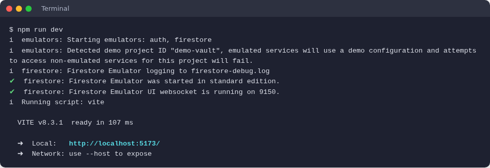

Open **http://localhost:5173** in your browser. The yellow bar at the top means you are in test mode: nothing here is real, and nothing leaves your computer.

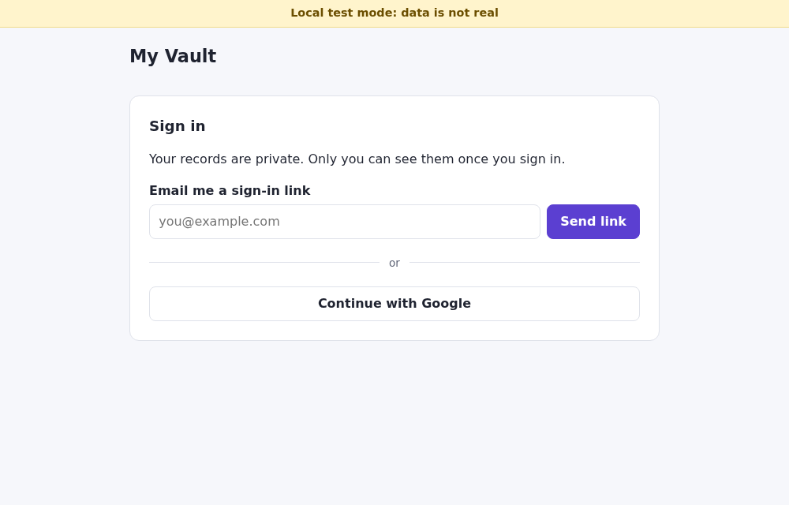

Type any email address and click **Send link**. No real email is sent in test mode. The app shows the link instead. Click **Open the sign-in link**:

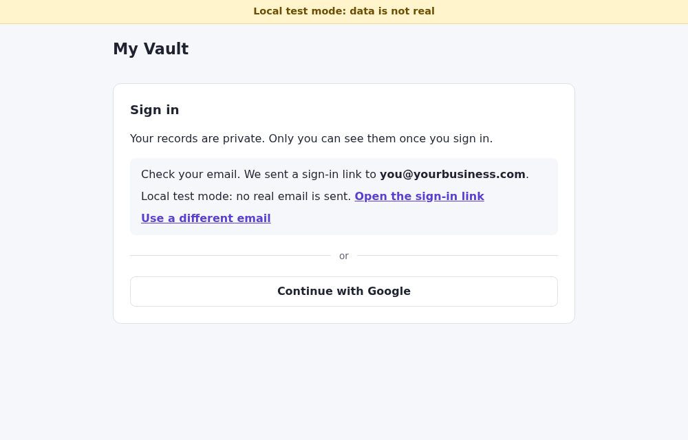

You're signed in. Add a few items, tick one off, edit one, delete one:


**Try the privacy for yourself.** Open a private (incognito) window, go to http://localhost:5173 again and sign in with a *different* email. That person sees an empty list. They cannot see the first person's items.

"Continue with Google" also works in test mode: it opens a pretend Google page where you click **Add new account**, then **Auto-generate user information**, then **Sign in with Google.com**.

When you're done, go back to the terminal and press **Ctrl+C** to stop it.

## 5. Run the security tests

These tests prove that nobody can see or change anyone else's records. Stop `npm run dev` first (Ctrl+C), then:

```
npm run test:rules
```

**You should see** a list of plain-English promises, each with a green tick, ending in `38 passed`:

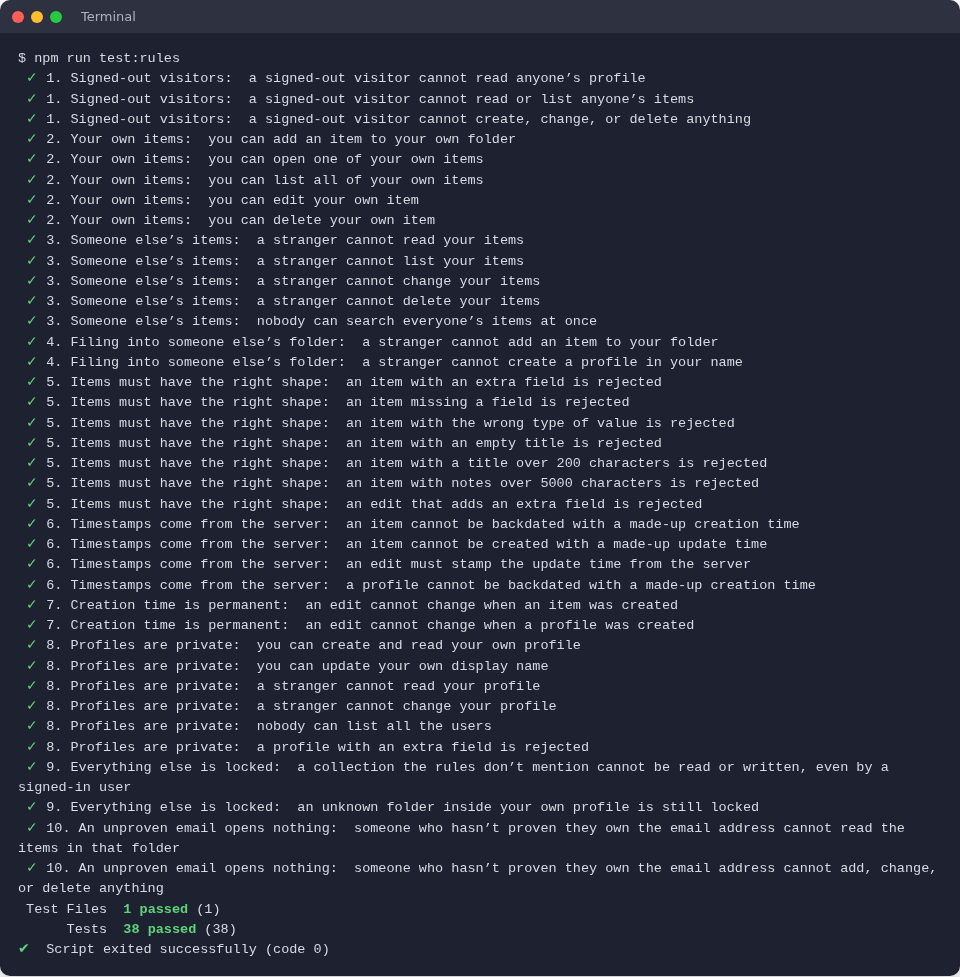

If you ever see a red `×`, a change has weakened the security. Don't publish until it's green again. [SECURITY.md](SECURITY.md) explains each promise.

## 6. Connect it to Firebase and put it online

Now the real thing. This one command does all of the Firebase setup:

```
npm run setup
```

Here is what it does for you, so you don't have to click through the Firebase website:

| Step | What `npm run setup` does |
|---|---|
| 1 | Checks Node.js and Java |
| 2 | Signs you in to Firebase (your browser opens once) |
| 3 | Creates a new Firebase project on the free plan |
| 4 | Registers the web app and saves its settings in a file called `.env.local` |
| 5 | Creates the database |
| 6 | Turns on "Continue with Google" and "Email me a sign-in link" |
| 7 | Builds the app and puts it on the internet |

If it stops partway (a network hiccup, a closed window), just run `npm run setup` again. It skips anything already done.

### Signing in to Firebase

The first time, your browser opens a Google page. Pick the Google account you want to own this app:

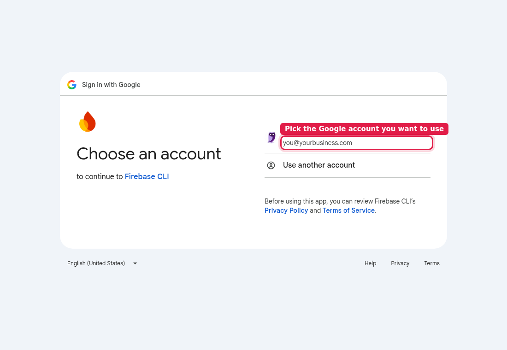

Google then asks whether the Firebase tools may manage your Firebase projects. Click **Allow**:

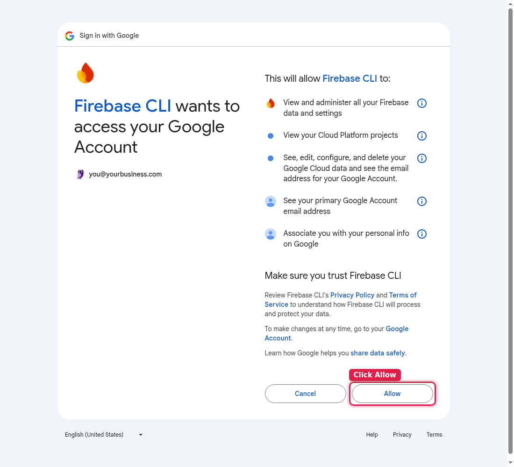

You'll see "Firebase CLI Login Successful" in the browser. Go back to the terminal.

### Answering the questions

The terminal asks a few questions. Press Enter to accept the suggestion shown in `[brackets]`.

- **Create a brand-new Firebase project?** Type `y`.
- **What should the project be called?** Any name, like your business or tool name.
- **Where are most of your users?** Pick the closest region. This can't be changed later.
- **Support email shown on the Google sign-in screen?** Press Enter to use your own email, or type a shared address like support@yourbusiness.com.
- **Publish the app now?** Press Enter (yes).

**You should see** every step get a green tick:

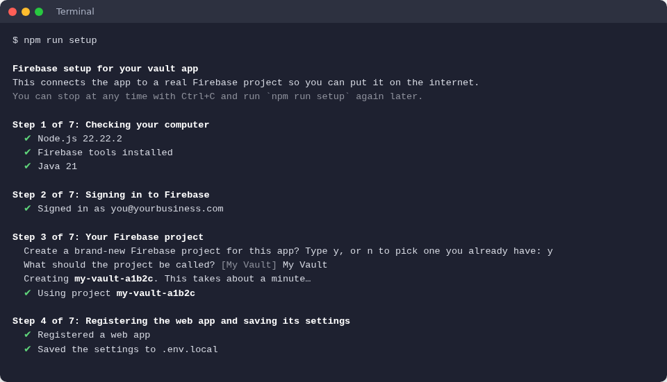

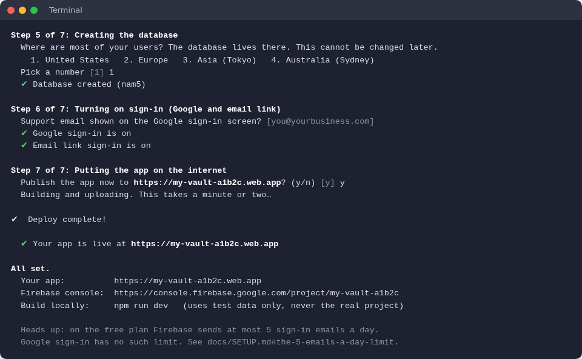

The last lines give your app's address, ending in `.web.app`. That's your live app.

## 7. Check your live app

Open the `.web.app` address. There is **no** yellow bar this time: this is the real app with real data. Sign in with Google or with an email link.

If you'd like to look behind the scenes, open the **Firebase console** link from the end of the setup output. You don't need to change anything there; these pictures just show what "set up correctly" looks like.

**Your project, on the free plan:**

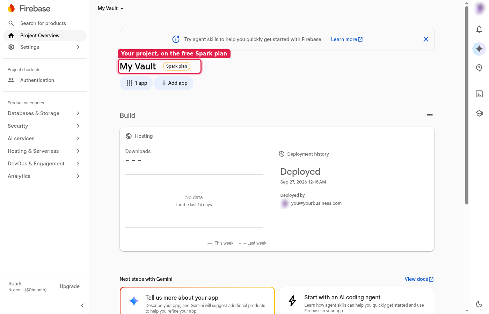

**Authentication → Sign-in method** shows both sign-in methods turned on:

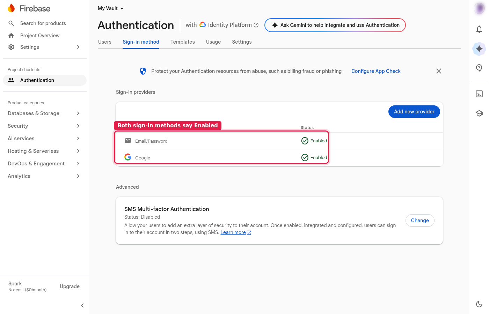

**Authentication → Users** lists everyone who has signed in:

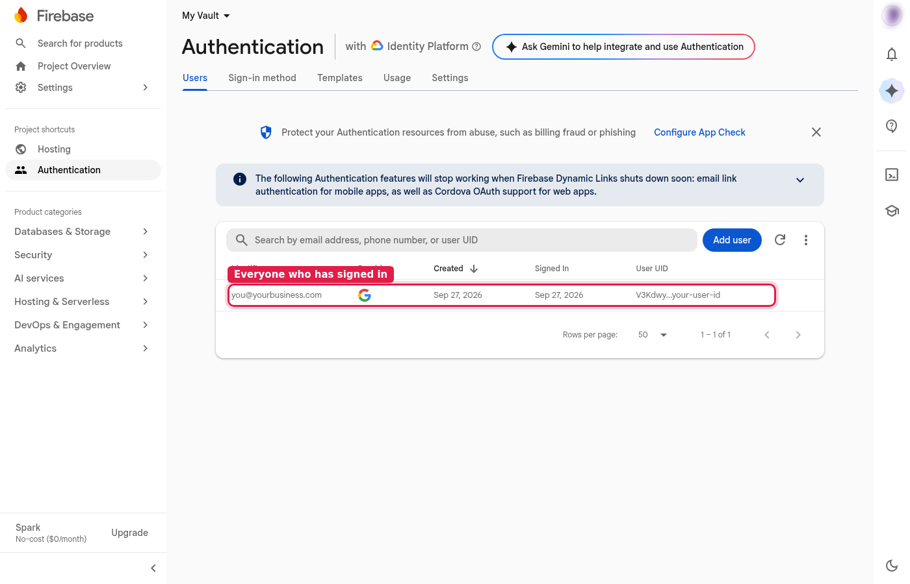

**Firestore Database → Data** shows the manila folders: one folder per person, their items filed inside. (See [SPINE.md](SPINE.md).)


**Firestore Database → Rules** shows the security rules that the tests prove:

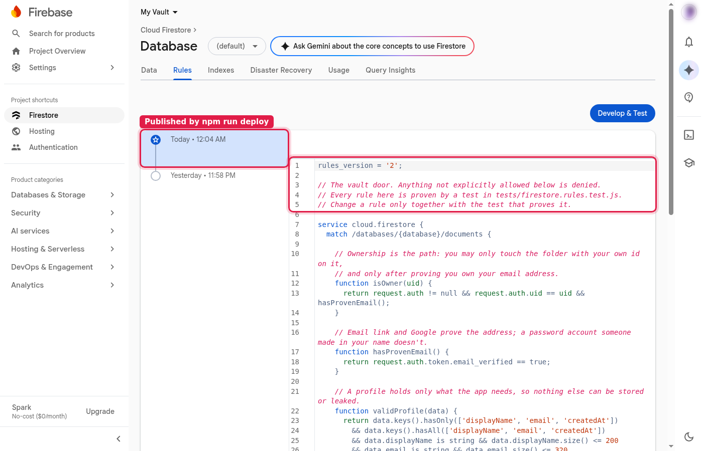

**Hosting** shows your app's web address:

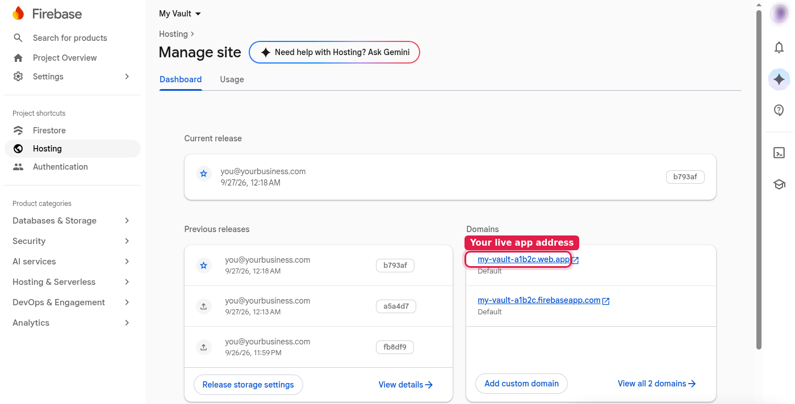

## 8. Publishing changes later

After you (or Claude) change the app, run the tests, then publish:

```
npm run test:rules
npm run deploy
```

`npm run deploy` builds the app and uploads it together with the security rules. It takes a minute or two and ends with `Deploy complete!`.

---

## The 5-emails-a-day limit

On Firebase's free plan (called **Spark**), Firebase will send **at most 5 sign-in link emails per day** for your whole app. "Continue with Google" has no such limit.

For a tool used by you and a couple of colleagues, Google sign-in plus the occasional email link is fine. If more people will sign in by email, switch the project to the **Blaze** plan. Blaze is pay-as-you-go, but it keeps the same free allowances, so a small internal tool usually still costs nothing. It raises the limit to 25,000 emails a day.

To switch: in the Firebase console click **Upgrade** (bottom left), then **Select plan** under Blaze, and follow the steps to add a billing account:

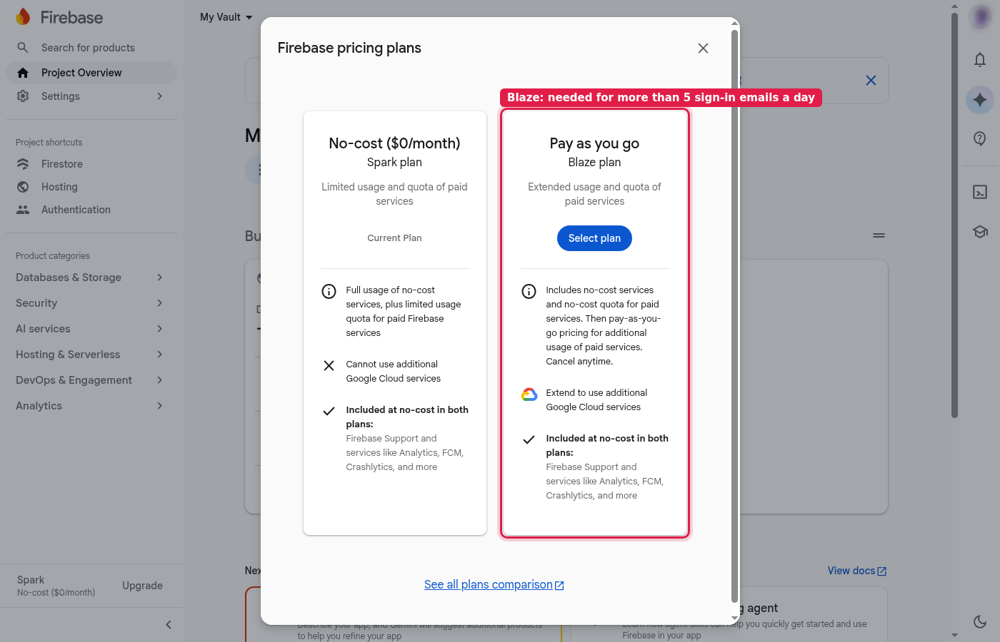

When you add billing, also set a **budget alert** (Google offers this during the upgrade). An alert at, say, $5 emails you long before a surprise.

Other free-plan limits worth knowing: up to 3,000 people can use sign-in per day, and at most 100 new accounts can be created per hour from one internet address.

## Using your own domain

Your app works at its `.web.app` and `.firebaseapp.com` addresses out of the box; they're already approved for sign-in:

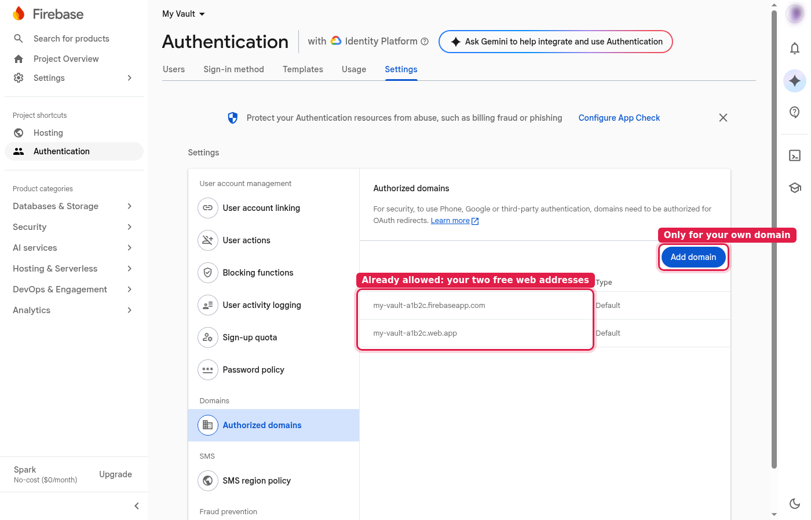

If you connect your own domain (Hosting → **Add custom domain**), you must also approve it for sign-in, or sign-in will fail with an "unauthorized domain" message. Go to **Authentication → Settings → Authorized domains**, click **Add domain**, and type your domain (for example `app.yourbusiness.com`).

---

## If something goes wrong

### "firebase-tools no longer supports Java version before 21"

Your Java is too old. See [Install Java](#install-java), then open a new terminal.

### "Could not start Firestore Emulator, port taken"

Something is already using the test database's spot. Usually it's `npm run dev` still running in another terminal window: press Ctrl+C there, then try again. If it keeps happening, restart your computer.

### "Your Firebase settings are missing from .env.local"

The app doesn't know which Firebase project to use yet. Run `npm run setup`.

### If creating the project fails

`npm run setup` can't create a project if:

- **Your Google account has never used Firebase.** Open [console.firebase.google.com](https://console.firebase.google.com), sign in, and accept the terms when asked. Then run `npm run setup` again.
- **You've reached your project limit.** Google allows a limited number of projects per account. Delete one you no longer use from the Firebase console (Project settings → General → Delete project), or run setup again and answer `n` to pick an existing project.
- **Your Google account belongs to a company (Google Workspace)** that restricts creating projects. Ask your Google admin, or use a different account.

### Create the database by hand

If step 5 says it couldn't create the database:

1. Open the Firebase console, pick your project, then **Databases & Storage → Firestore**.
2. Click **Create database**.
3. Choose a location near your users, then choose **Start in production mode**. (Production mode starts locked; `npm run deploy` then uploads this app's rules.)
4. Run `npm run setup` again.

### Turn on sign-in by hand

If step 6 says it couldn't turn on a sign-in method, setup pauses and shows a link. Open it (Authentication → Sign-in method). If you see **Get started**, click it first.

**Email link:** click **Add new provider** (or the Email/Password row if it's already listed), then **Email/Password**:

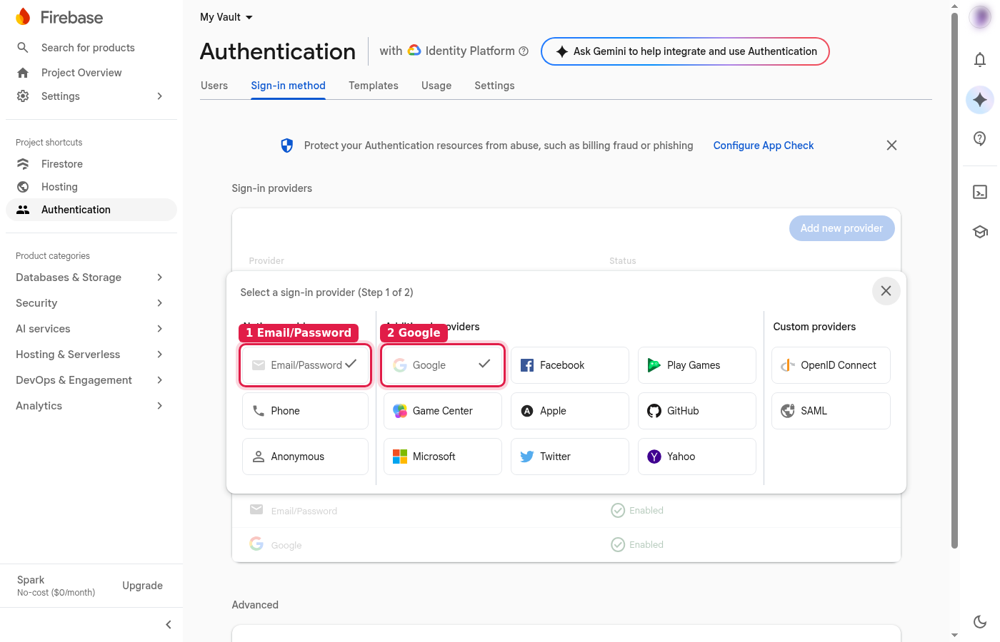

Switch on **both** toggles, *Email/Password* and *Email link (passwordless sign-in)*, then click **Save**. The app never shows a password box; Firebase simply requires the first toggle for email links to work.

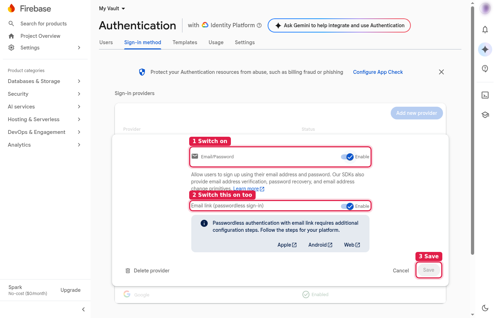

**Google:** click **Add new provider**, then **Google**. Switch it on, choose your email as the support email, and click **Save**:

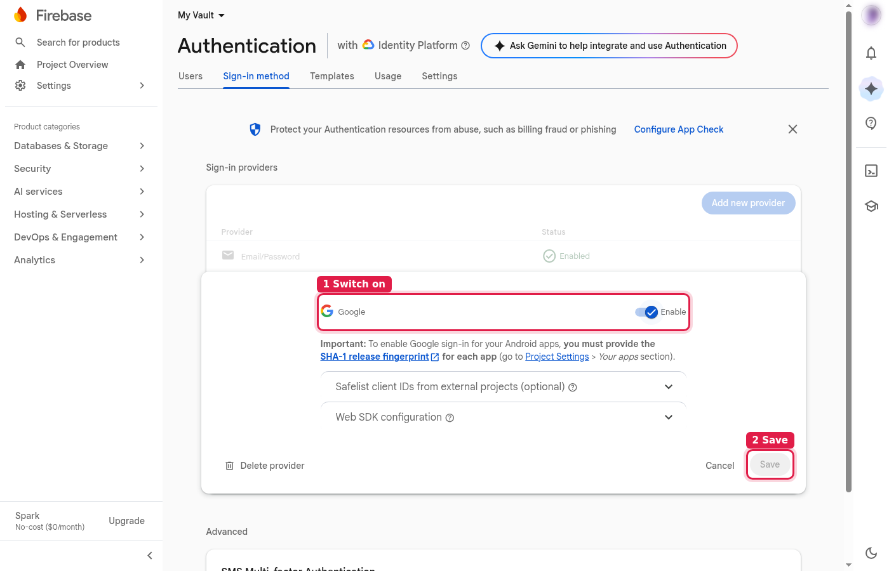

Go back to the terminal and press Enter.

### Sign-in on the live site says "unauthorized domain"

You're using an address that isn't approved. See [Using your own domain](#using-your-own-domain).

### Sign-in says "This sign-in method is turned off"

A sign-in method isn't enabled. Run `npm run setup` again, or see [Turn on sign-in by hand](#turn-on-sign-in-by-hand).

### Removing everything

To delete the app and all its data: Firebase console → gear icon → **Project settings** → scroll to the bottom → **Delete project**. Google keeps it recoverable for 30 days.
