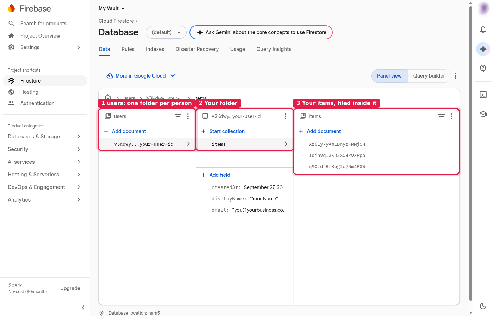

# The spine: how the data is filed

Picture a filing cabinet full of manila folders.

- **One folder per person.** When someone signs in for the first time, they get a folder with their name on the tab.
- **Their items are filed inside their folder.** Nowhere else.
- **Nothing is shared between folders.** There is no common drawer, no shared pile, no folder that belongs to two people.

The security rules only have to answer one question: *is this your folder?* If the name on the tab is yours, you can open it. If not, you can't. Because where a record is filed decides who owns it, there's no "owner" field someone could quietly edit to claim another person's records.

```
users/                              the filing cabinet
  {your user id}/                   your folder
    displayName, email, createdAt   the label on your folder
    items/                          the items filed in your folder
      {item id}/                    one item
        title, notes, done, createdAt, updatedAt
  {someone else's id}/              their folder: you can't open it
    ...
```



## The folder label: `users/{uid}`

| Field | Type | Rules |
|---|---|---|
| `displayName` | text | Up to 200 characters. From Google; empty for email-link sign-ins. |
| `email` | text | Up to 320 characters. |
| `createdAt` | time | Set by Firebase's clock when the folder is created. Never changes. |

Nothing else can be stored here. The app creates this the first time a person signs in.

## An item: `users/{uid}/items/{itemId}`

| Field | Type | Rules |
|---|---|---|
| `title` | text | Required, 1 to 200 characters. |
| `notes` | text | 0 to 5,000 characters. |
| `done` | yes/no | |
| `createdAt` | time | Set by Firebase's clock when the item is created. Never changes. |
| `updatedAt` | time | Set by Firebase's clock on every change. |

Every item has exactly these five fields: no more, no fewer. The times come from Firebase, not from the person's computer, so nobody can backdate a record.

## Why so strict?

**Data that isn't there can't be stolen.** Every field is something to protect, so the rules allow only the fields the app actually needs, with size limits so nobody can stuff in extra data. When you add your own record type, draw its spine first, like this page. See [EXTENDING.md](EXTENDING.md).
